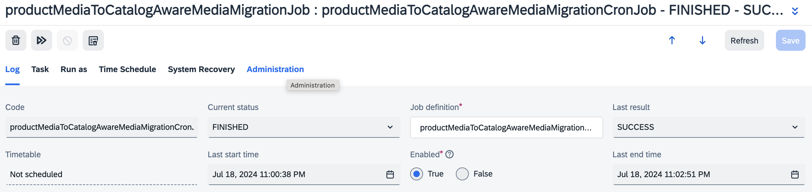

# Migrating Product Media to Catalog Aware Media

Please refer to the [blog post](https://community.sap.com/t5/crm-and-cx-blogs-by-sap/enhancing-scalability-of-your-product-catalog-with-catalog-unaware-media/ba-p/13762371) to understand the background and the scenarios where it can be useful.

## Introducing CatalogUnawareMediaContainer
The first step for the migration is to introduce `CatalogUnawareMediaContainer` item type. The standard item type of the media container is catalog aware. Since, multiple media containers cannot own a single media. It becomes impossible to refer the same media in the media containers of two or more catalog versions. Hence, introduction of a `CatalogUnawareMediaContainer` is a must for this migration. To create this do the following:
1. Create the `CatalogUnawareMediaContainer` item type using the following item definition:
    ```xml
    <itemtype code="CatalogUnawareMediaContainer" autocreate="true" generate="true" extends="MediaContainer"
                    jaloclass="de.hybris.platform.jalo.media.CatalogUnawareMediaContainer">
        <custom-properties>
            <property name="catalogItemType"><value>java.lang.Boolean.FALSE</value></property>
        </custom-properties>
        <attributes>
            <attribute qualifier="catalogVersion" type="CatalogVersion" redeclare="true">
                <persistence type="property"/>
                <modifiers optional="true" initial="false" />
            </attribute>
        </attributes>
    </itemtype>
    ```
2. Execute the `System Update` to ensure that the `CatalogUnawareMediaContainer` is available to your SAP Commerce persistence.

After this, proceed ahead with the migration script.

## Migration of Media to Catalog Unaware Media & Media Container to Catalog Unaware Media Container
The [ImpEx script](./mediamigration/resources/impex/essentialdata_mediamigration.impex) is a sample to migrates the media of `apparelProductCatalog` to CatalogAware Media. You can import this script to create the cron job and then manually execute it during the quiet business hours.

<p>

<u><strong>Figure </strong> | Migration Cron Job</u>
</p>

You can adjust the script for your usage by:
- Updating the `id` and `version` of your online catalog version.
- Updating the `Media` attributes of your product item model
- Updating the `MediaCollection` attributes of your product item model
- Updating to `MediaContainer` attributes of your product item model

Feel free to enhance the script as per your need.

## Optimizations at source integration / user experience
### Backoffice
If you like to simplify the backoffice user interface to avoid mistakes from the business users. You can update the backoffice configurations of product editor area to ensure that the business user creates the `CatalogUnawareMedia` and `CatalogUnawareMediaContainer` during product enrichments.

### Integrations
If there are automations / integrations to create the product media for example: ImpEx, Cloud Hot Folders, etc; It is recommended that you correct the headers to ensure that the Media is created for product as `CatalogUnawareMedia` and the media container is created as `CatalogUnawareMediaContainer`.

### Media Conversion
If you are using media conversion then make sure to create a class `CatalogUnawareConvertedMediaCreationStrategy` by overriding `DefaultConvertedMediaCreationStrategy` to ensure that your converted media are created as `CatalogUnawareMedia` as:

```
package com.sap.cx.boosters.commerce.media.migration.strategy;

import de.hybris.platform.catalog.model.CatalogUnawareMediaModel;
import de.hybris.platform.core.model.media.MediaModel;
import de.hybris.platform.mediaconversion.conversion.DefaultConvertedMediaCreationStrategy;
import de.hybris.platform.mediaconversion.model.ConversionMediaFormatModel;
import de.hybris.platform.servicelayer.exceptions.ModelNotFoundException;
import de.hybris.platform.servicelayer.media.MediaIOException;
import org.apache.log4j.Logger;

import java.io.InputStream;

public class CatalogUnawareConvertedMediaCreationStrategy extends DefaultConvertedMediaCreationStrategy {

    private static final Logger LOG = Logger.getLogger(CatalogUnawareConvertedMediaCreationStrategy.class);

    @Override
    public MediaModel createOrUpdate(final MediaModel parent, final ConversionMediaFormatModel format, final InputStream content)
            throws MediaIOException {

        if (parent instanceof CatalogUnawareMediaModel) {

            MediaModel dmm;
            try {
                dmm = this.getMediaService().getMediaByFormat(parent.getMediaContainer(), format);
                LOG.debug("Updating existing media '" + dmm + "'.");
            } catch (final ModelNotFoundException e) {
                dmm = this.getModelService().create(CatalogUnawareMediaModel.class);
                dmm.setCode(this.createCode(parent, format));
                dmm.setFolder(parent.getFolder());
                dmm.setMediaContainer(parent.getMediaContainer());
                dmm.setMediaFormat(format);

                // additional
                dmm.setAltText(parent.getAltText());
                dmm.setDescription(parent.getDescription());
            }

            dmm.setOriginal(parent);
            dmm.setOriginalDataPK(parent.getDataPK());
            this.getModelService().save(dmm);

            this.loadContents(dmm, parent, format, content);
            this.getModelService().refresh(dmm);

            return dmm;
        } else {
            return super.createOrUpdate(parent, format, content);
        }
    }
}
```

Also register the following spring bean:

```
<alias name="catalogUnawareConvertedMediaCreationStrategy" alias="convertedMediaCreationStrategy"/>
<bean id="catalogUnawareConvertedMediaCreationStrategy" class="com.sap.cx.boosters.commerce.media.migration.strategy.CatalogUnawareConvertedMediaCreationStrategy" parent="defaultConvertedMediaCreationStrategy"/>

```

>**Note 1:** Please adjust package structure as per your project's package structure.

>**Note 2:** As an alternative, You can use the mediamigration extension available [here](./mediamigration), followed by a system update and execution of the `productMediaToCatalogAwareMediaMigrationCronJob` cron job.


>**Disclaimers**
> - This script creates a sample migration cron job that on execute migrates the media of `apparelProductCatelog`. This script has not been tested extensively on a productive environment. This is recommended to test the script extensively prior to execute it on a productive environment.
> - This is recommended to execute such a migration in Off-Peak hours as this migration may impact customer experience.
> - This is a reference created to share the knowledge based on the experience from past engagements. There is no dedicated support available on this script, neither from the author and not from SAP.
