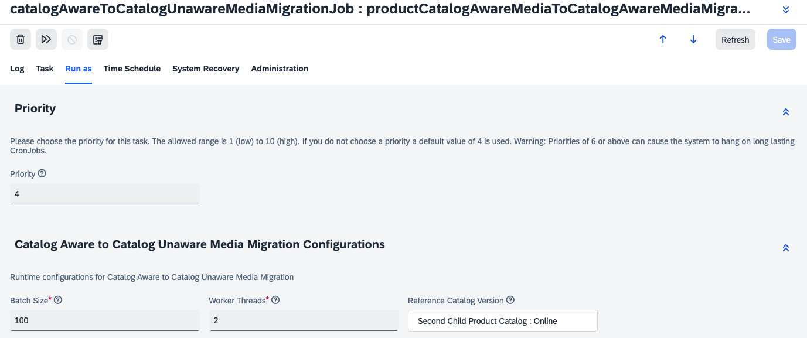

# Migrating Product Media to Catalog Aware Media

Please refer to the [blog post](https://community.sap.com/t5/crm-and-cx-blogs-by-sap/enhancing-scalability-of-your-product-catalog-with-catalog-unaware-media/ba-p/13762371) to understand the background and the scenarios where it can be useful.

## Introducing CatalogUnawareMediaContainer
The first step for the using `CatalogUnawareMedia` for products is to introduce `CatalogUnawareMediaContainer` item type to support it with `gallery` images. The standard item type of the media container is catalog aware. Since, multiple media containers cannot own a single media. It becomes impossible to refer the same media in the media containers of two or more catalog versions. Hence, introduction of a `CatalogUnawareMediaContainer` is a must for this migration. To create this do the following:
1. Create the `CatalogUnawareMediaContainer` item type using the following item definition. Refer to the [item configuration](./mediamigration/resources/mediamigration-items.xml).
2. The next step is to implement a cron job that migrated the Catalog Aware Media to Catalog Unaware Media. Refer to the [Job implementation](./mediamigration/src/com/sap/cx/boosters/commerce/media/migration/job/CatalogAwareToCatalogUnawareMediaMigrationJob.java). This job is a multi-threaded job to migrate the product medias in a configurable batch size. Also the reference catalog version can be configuredc with the cron job. Please refere to the Cron Job definition in the item definition of [CatalogAwareToCatalogUnawareMediaMigrationCronJob](./mediamigration/resources/mediamigration-items.xml)

3. The next step is to build and execute the `System Update` to ensure that the `CatalogUnawareMediaContainer` and the job is available to your SAP Commerce cloud environment.

4. After this, proceed ahead with configuration and execution of the migration cron job.

## Configuring the Cron job for Migration of Media to Catalog Unaware Media & Media Container to Catalog Unaware Media Container
The [ImpEx script](./mediamigration/resources/impex/essentialdata_mediamigration.impex) is a sample script as commented to create a cron job to migrate the media of `apparelProductCatalog` to CatalogAware Media. You can adjust this ImpEx script to create the cron job and then execute it during the quiet business hours with following adjustments:
- Batch size to pick how many products to pick in one batch.
- Migration workers to configure how many worker threads to use for migration.
- Reference catalog version to configura the catalog version that has all accurate medias associated across the product catalog versions.

<u><strong>Figure </strong> | Migration Cron Job Configurations</u>

## Alternatives
If you wish to use the migration job via Scripting engine, then you can use the [ImpEx Script](./mediamigration/resources/mediamigration/cron-jobs.impex) to create the cron job. This script has:
- `apparelProductCatalog:Online` as the reference catalog version configured.
- The batch size of 100 products
- A total of 8 migration workers to process migration.

Feel free to adjust these parameters in the script and import the ImpEx to create the cron job via scripting engine.

## Optimizations at source integration / user experience
### Backoffice
If you like to simplify the backoffice user interface to avoid mistakes from the business users. You can update the backoffice configurations of product editor area to ensure that the business user creates the `CatalogUnawareMedia` and `CatalogUnawareMediaContainer` during product enrichments.

### Integrations
If there are automations / integrations to create the product media for example: ImpEx, Cloud Hot Folders, etc; It is recommended that you correct the headers to ensure that the Media is created for product as `CatalogUnawareMedia` and the media container is created as `CatalogUnawareMediaContainer`.

### Media Conversion
The extension covers you if youn are using the media conversion functionality. With this the regular Media converts in the disired formats as regular media and the Catalog Unaware Media converts in the disired formats as catalog unaware media.

>**Disclaimers**
> - This extension creates a sample migration cron job (if uncommented) that on execute migrates the media of `apparelProductCatelog`. This is recommended to test the migration extensively to identify appropriate configurations like batch size and number of workers, prior to execute it on a productive environment.
> - This is recommended to execute such a migration in Off-Peak hours as this migration may impact customer experience.
> - This is a reference created to share the knowledge based on the experience from past engagements. There is no dedicated support available on this script, neither from the author and not from SAP.
